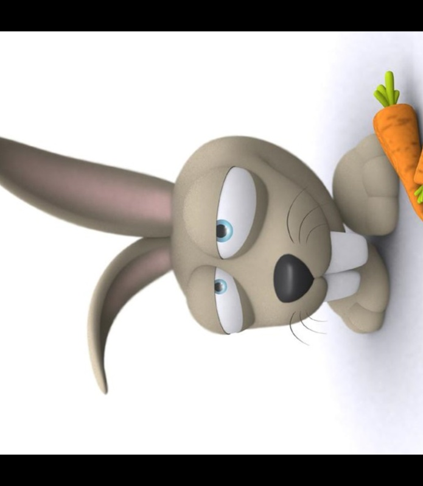

## TODO:

- [ ] Zoom/Stretch
- [ ] function comments


## Image Augmentor

This is a simple data augmentation tool for image files, intended for use with machine learning data sets.
The tool scans a directory containing image files, and generates new images by performing a specified set of
augmentation operations on each file that it finds. This process multiplies the number of training examples that can
be used when developing a neural network, and should significantly improve the resulting network's performance,
particularly when the number of training examples is relatively small.

Run the utility from the command-line as follows:

    python main.py <image dir> <transform1> <transform2> ...

The `<image dir>` argument should be the path to a directory containing the image files to be augmented.
The utility will search the directory recursively for files with any of the following extensions:
`jpg, jpeg, bmp, png`.

The `transform` arguments determine what types of augmentation operations will be performed,
using the codes listed in the table below:

|Code|Description|Options|Example Values|
|---|---|---|------|
|`fliph`|Horizontal Flip||`fliph`|
|`flipv`|Vertical Flip||`flipv`|
|`noise`|Adds random noise to the image||`noise_20`,`noise_50`|
|`rot`|Rotates the image by the specified amount||`rot_90`,`rot_-45`|
|`trans`|Shifts the pixels of the image by the specified amounts in the x and y directions||`trans_20_10`,`trans_-10_0`|
|`zoom`|Zooms into the specified region of the image, performing stretching/shrinking as necessary||`zoom_0_0_20_20`,`zoom_-10_-20_10_10`|
|`blur`|Blurs the image by the specified amount|`1,3,7,9,11,...`|`blur_1`|


Each transform argument results in one additional output image being generated for each input image.
An argument may consist of one or more augmentation operations. Multiple operations within a single argument
must be separated by commas, and the order in which the operations are performed will match the order in which they
are specified within the argument.

### Examples
Produce 2 output images for each input image, one of which is flipped horizontally, and one of which is flipped vertically:

    python main.py ./my_images fliph flipv

Produce 1 output image for each input image, by first rotating the image by 90&deg; and then flipping it horizontally:

    python main.py ./my_images rot_90,fliph

### Operations

#### Horizontal Flip
Mirrors the image around a vertical line running through its center
```shell
python main.py ./my_images fliph
```
&nbsp;


#### Vertical Flip
Mirrors the image around a horizontal line running through its center
```shell
python main.py ./my_images flipv
```
&nbsp;


#### Noise
Adds random noise to the image. The amount of noise to be added is specified by a floating-point numeric value that is included
in the transform argument, the numeric value must be greater than 0.
```shell
python main.py ./my_images noise_20 noise_50 noise_100
```
&nbsp;


#### Rotate
Rotates the image. The angle of rotation is specified by an integer value that is included in the transform argument.
```shell
python main.py ./my_images rot_90 rot_180 rot_-90
```



#### Translate
Performs a translation on the image. The size of the translation in the x and y directions are specified by integer values that
are included in the transform argument
```shell
python main.py ./my_images trans_20_20 trans_0_100
```
&nbsp;&nbsp;


#### Zoom/Stretch
Zooms in (or out) to a particular area of the image. The top-left and bottom-right coordinates of the target region are
specified by integer values included in the transform argument. By specifying a target region with an aspect ratio that
differs from that of the source image, stretching transformations can be performed.

    python main.py ./my_images zoom_150_0_300_150 zoom_0_50_300_150 zoom_200_0_300_300

#### Blur
Blurs the image by the `cv2.GaussianBlur()` of the opencv. The amount of blurring is specified by a  positive and odd value or zeros. Details in [GaussianBlur()](https://docs.opencv.org/master/d4/d86/group__imgproc__filter.html#gaabe8c836e97159a9193fb0b11ac52cf1). See `assets/blur/` for more examples.
```shell
python main.py ./my_images blur_1 blur_3 blur_9 blur_19
```
&nbsp;&nbsp;&nbsp;
